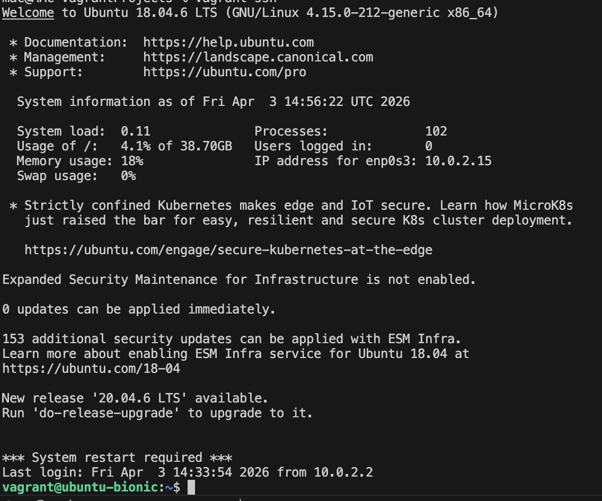
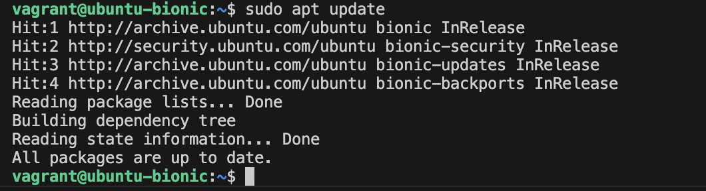
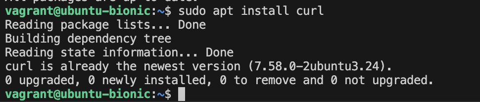
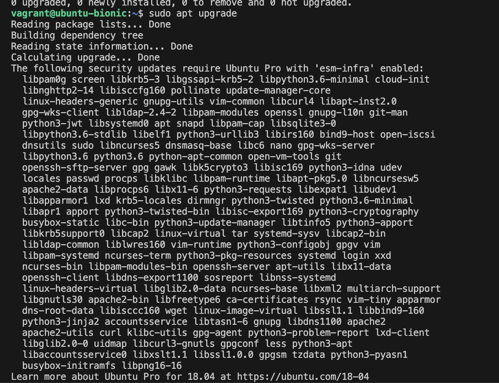
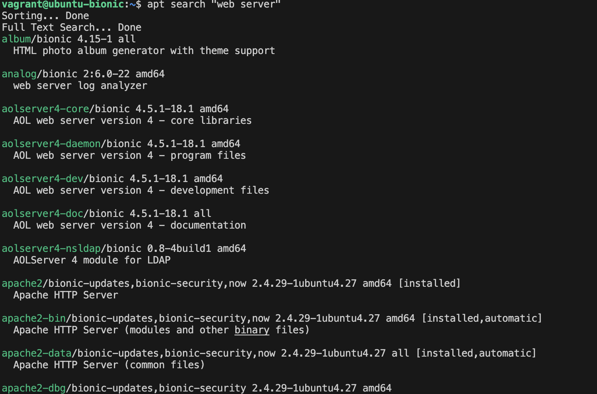

# Package Management Project

## Objective
To learn how to manage software packages on a Linux system using the apt package manager.

## Step 1: Access the Linux System

I accessed the Vagrant virtual machine using the command: vagrant ssh

### Output

## Step 2: Update Package Repository

I updated the package repository using the command: sudo apt update

### Output  

## Step 3: Install curl

I installed the curl package using the command: sudo apt install curl.  
The system indicated that curl was already installed and up to date.

### Output

## Step 4: Upgrade Installed Packages

I upgraded the system packages using the command: sudo apt upgrade.  
This updated all available packages on the system.

### Output

## Step 5: Search for Packages

I searched for packages related to "web server" using the command: apt search "web server".  
The system returned several relevant packages.

### Output  

## Conclusion
In this project, I successfully performed package management tasks on a Linux system. I updated the repository, installed a package, upgraded system packages, and searched for available packages. This demonstrates my understanding of basic package management using apt