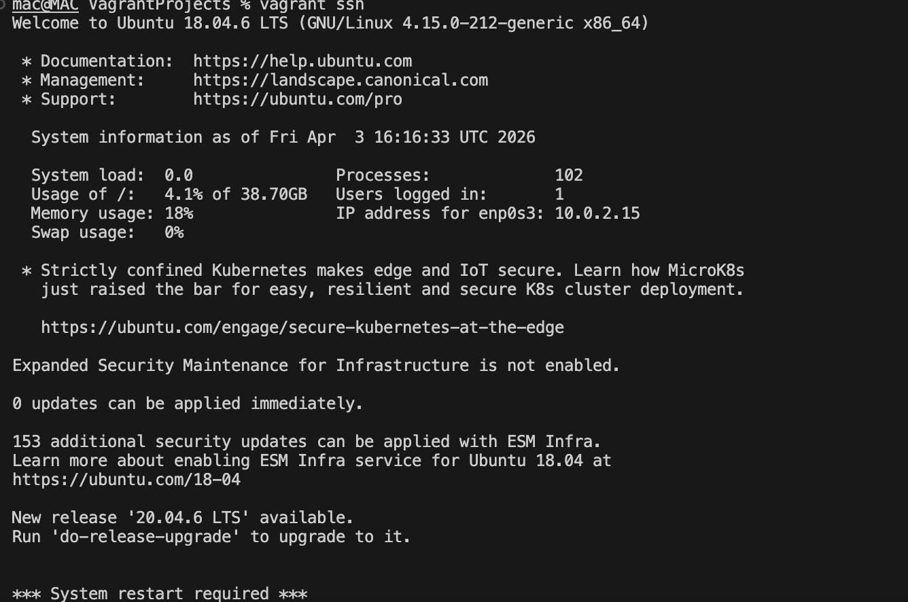
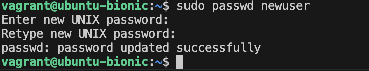
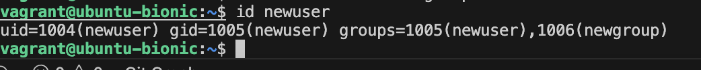
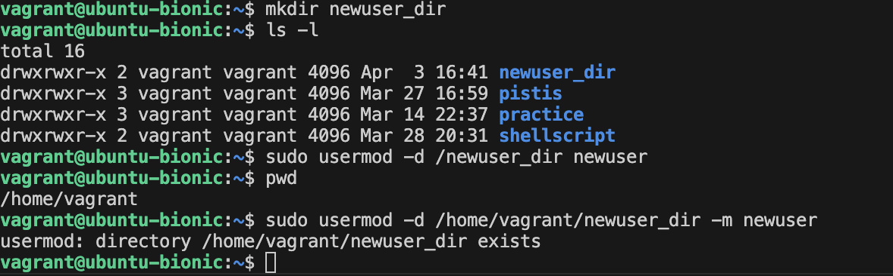
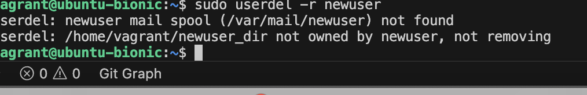

# User and Group Management Project

## Objective
To learn how to manage user accounts and groups on a Linux system, including creating, modifying, and deleting users and groups.

## Step 1: Access the Linux System

I accessed the Vagrant virtual machine using the command: vagrant ssh

### Output 

## Step 2: Open a Terminal

A terminal session was opened after accessing the Vagrant environment.

## Step 3: Create a New User

I created a new user named `newuser` using the command: sudo useradd newuser

### Output 

## Step 4: Set a Password for the New User

I set a password for the new user using the command: sudo passwd newuser

### Output 

## Step 5: Create a New Group

I created a new group named `newgroup` using the command: sudo groupadd newgroup

### Output

## Step 6: Add User to a Group

I added the newly created user to the group using the command: sudo usermod -aG newgroup newuser

### Output

## Step 7: Verify User and Group Creation

I verified that the user was created successfully using the command: id newuser

### Output

I also verified that the group was created successfully using the command: getent group newgroup

### Output

## Step 8: Modify User Information

I modified the user's home directory using the command: sudo usermod -d /home/vagrant/newuser_dir -m newuser

### Output

## Step 9: Delete a User

I deleted the user and its associated files using the command: sudo userdel -r newuser

### Output

## Step 10: Delete a Group

I deleted the group using the command: sudo groupdel newgroup

### Output

## Conclusion

In this project, I successfully learned how to manage users and groups on a Linux system. I created a new user, assigned a password, created a group, added the user to the group, verified both the user and group, modified the user's home directory, and finally deleted both the user and the group. This demonstrates my understanding of basic user and group management in Linux.