# Linux Project 5

## Step 1: Update Package Repository

Command used:  
sudo apt update

### Output  
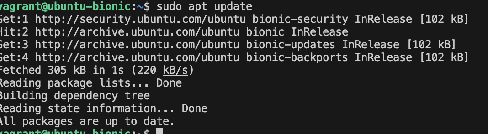

---

## Step 2: Install Apache

Command used:  
sudo apt install apache2

### Output  
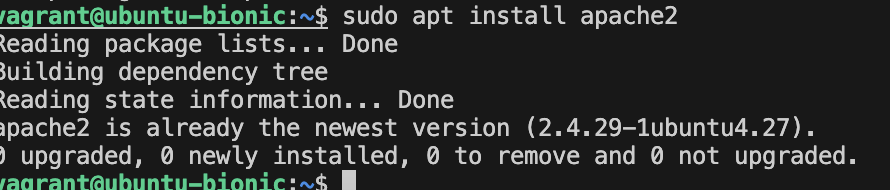

---

## Step 3: Allow Apache Through Firewall

Command used:  
sudo ufw allow in "Apache"

### Output  
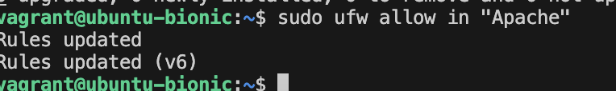

---

## Step 4: Check Apache Status

Command used:  
sudo systemctl status apache2

### Output  
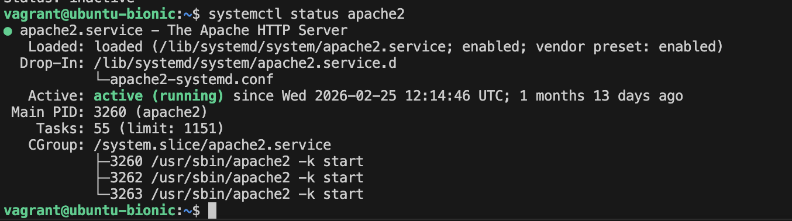

---

## Step 5: Install MySQL Server

Command used:  
sudo apt install mysql-server

### Output  
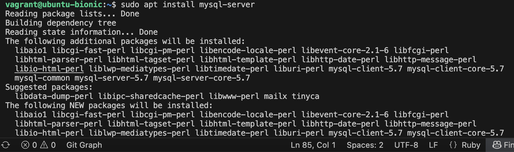

---

## Step 6: Secure MySQL Installation

Command used:  
sudo mysql_secure_installation

### Output  
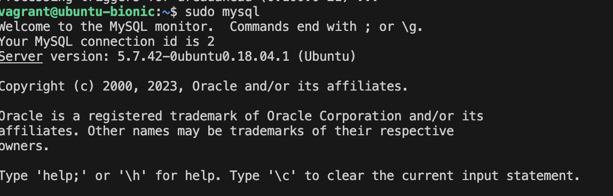

---

## Step 7: Log into MySQL

Command used:  
sudo mysql

### Output  
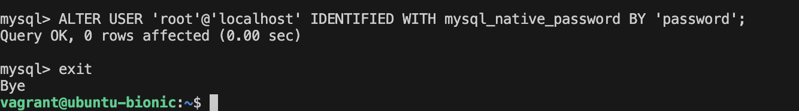

---

## Step 8: Set Root Authentication

Command used:  
ALTER USER 'root'@'localhost' IDENTIFIED WITH mysql_native_password BY 'password';

### Output  
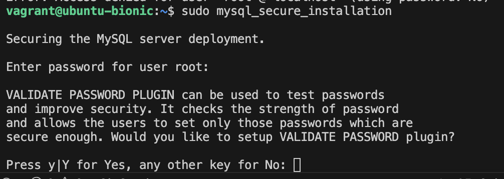

---

## Step 9: Exit MySQL

Command used:  
exit

### Output  
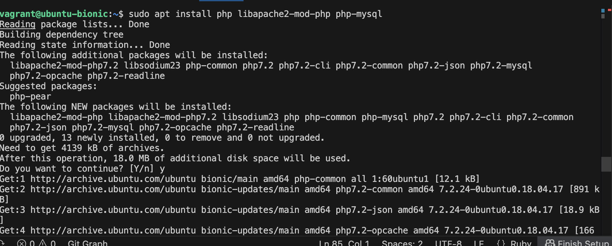

---

## Step 10: Install PHP

Command used:  
sudo apt install php libapache2-mod-php php-mysql

### Output  
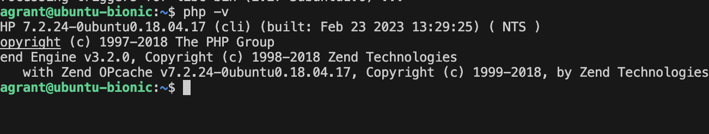

---

## Step 11: Check PHP Version

Command used:  
php -v

### Output  
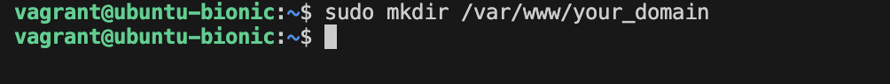

---

## Step 12: Create Project Directory

Command used:  
sudo mkdir /var/www/your_domain

### Output  
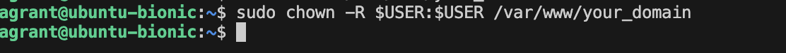

---

## Step 13: Change Ownership

Command used:  
sudo chown -R $USER:$USER /var/www/your_domain

### Output  
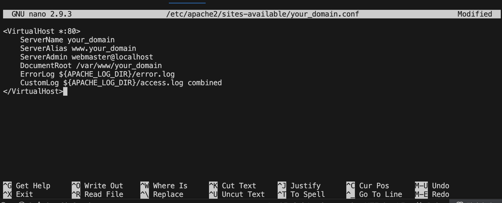

---

## Step 14: Create PHP Info File

Command used:  
sudo nano /var/www/html/info.php

Content added:  
<?php phpinfo(); ?>

### Output  
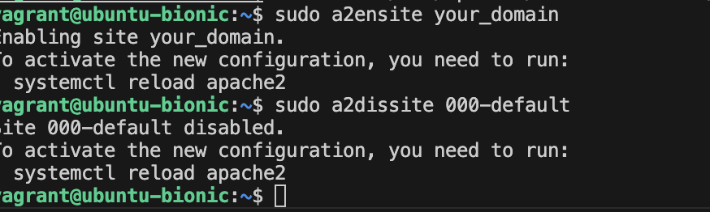

---

## Step 15: Restart Apache

Command used:  
sudo systemctl reload apache2

### Output  
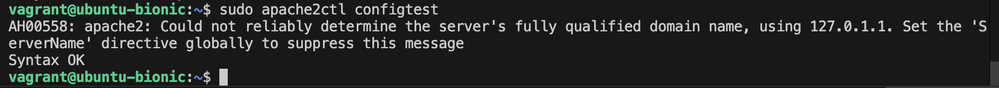

---

## Step 16: Check IP Address

Command used:  
ip a

### Output  
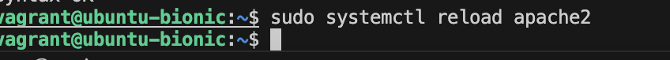

---

## Step 17: Configure Port Forwarding (Vagrantfile)

Configuration added:  
config.vm.network "forwarded_port", guest: 80, host: 8080

### Output  
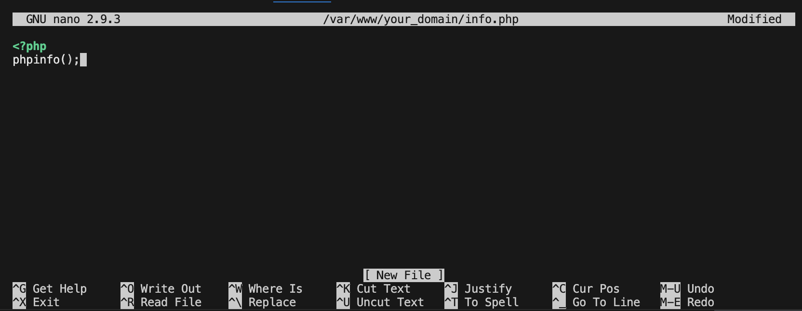

---

## Step 18: Reload Vagrant Machine

Command used:  
vagrant reload --provision

### Output  
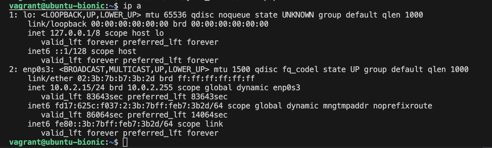

---

## Step 19: Verify Port Mapping

Command used:  
vagrant port

### Output  
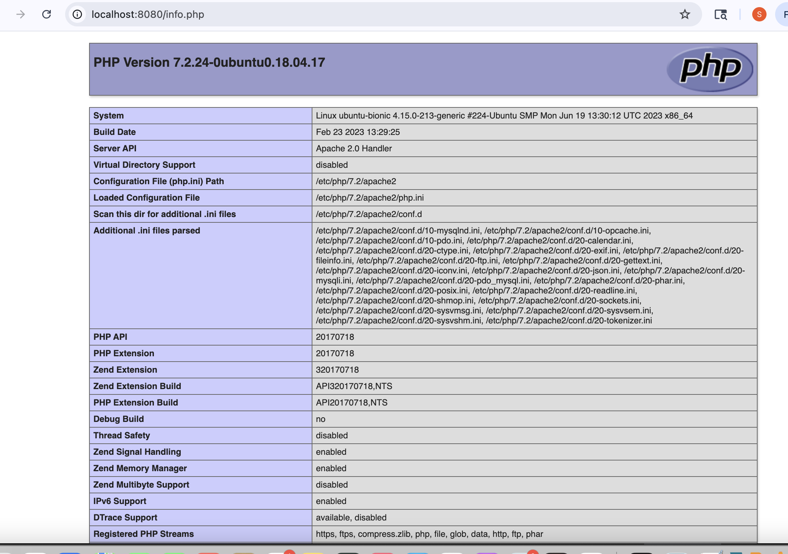

---

## Step 20: Access PHP Page in Browser

URL used:  
http://localhost:8080/info.php

### Output  
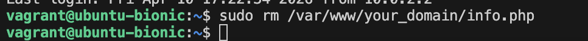