# Linux Project 6 (LEMP Stack)

## Step 1: Update Package Repository

Command used:  
sudo apt update  

### Output  
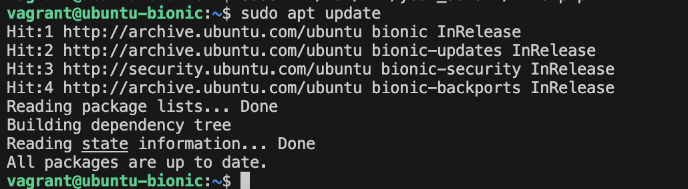

---

## Step 2: Install Nginx

Command used:  
sudo apt install nginx  

### Output  
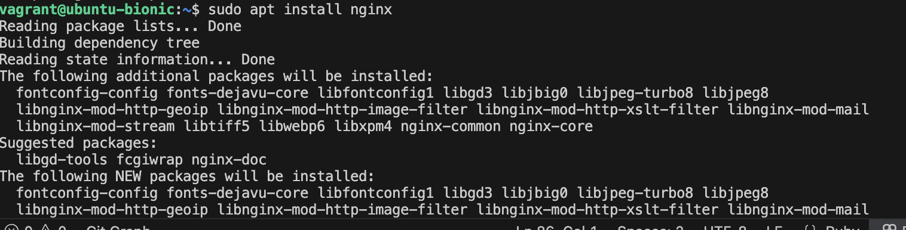

---

## Step 3: Check Available UFW Profiles

Command used:  
sudo ufw app list  

### Output  
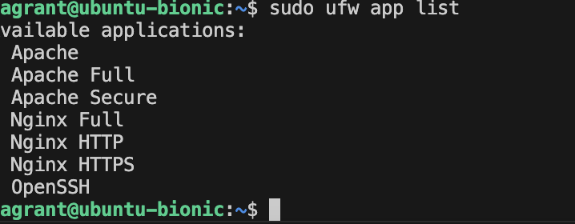

---

## Step 4: Allow Nginx HTTP Through Firewall

Command used:  
sudo ufw allow 'Nginx HTTP'  

### Output  
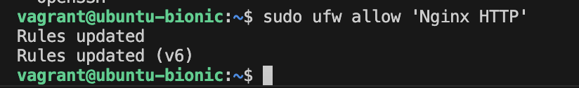

---

## Step 5: Verify Firewall Status

Command used:  
sudo ufw status  

### Output  
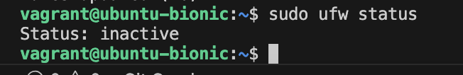

---

## Step 6: Check Server IP Address

Command used:  
ip addr show enp0s3  

### Output  
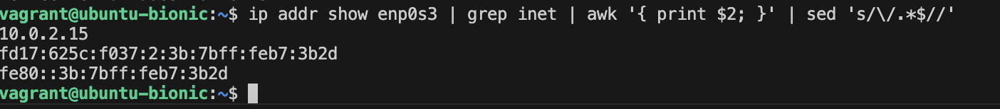

---

## Step 7: Test Nginx in Browser

URL used:  
http://localhost:8080  

### Output  
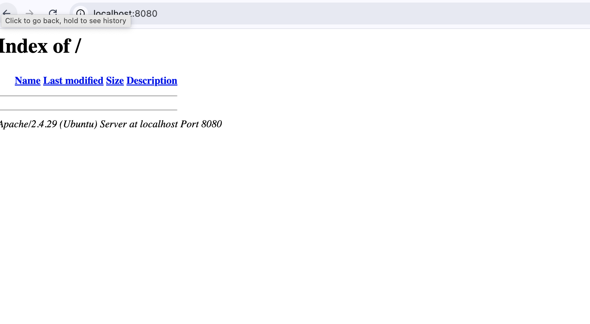

---

## Step 8: Install MySQL Server

Command used:  
sudo apt install mysql-server  

### Output  
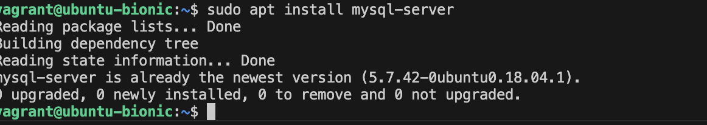

---

## Step 9: Secure MySQL Installation

Command used:  
sudo mysql_secure_installation  

### Output  
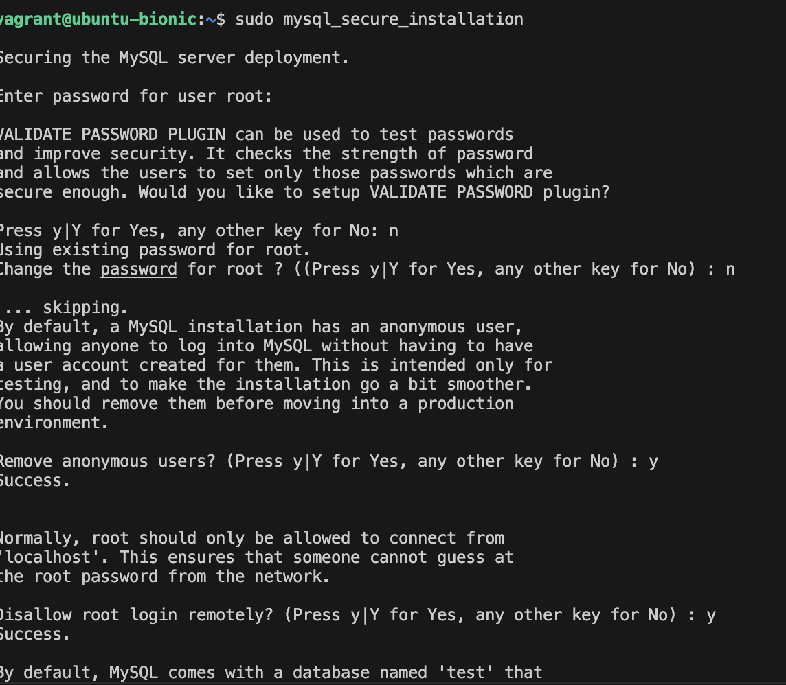

---

## Step 10: Log into MySQL

Command used:  
sudo mysql  

### Output  
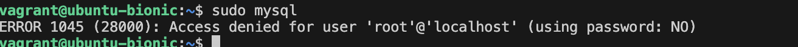

---

## Step 11: Install PHP and Required Modules

Command used:  
sudo apt install php-fpm php-mysql  

### Output  
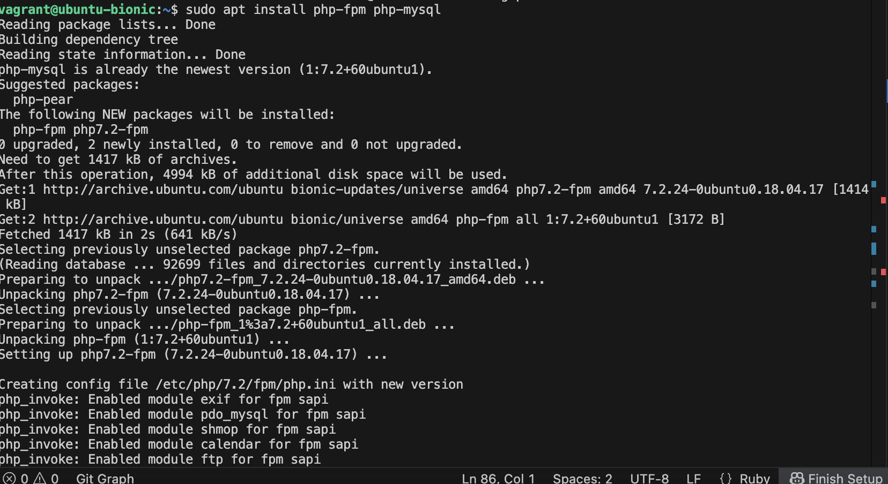

---

## Step 12: Create Project Directory

Command used:  
sudo mkdir /var/www/your_domain  

### Output  
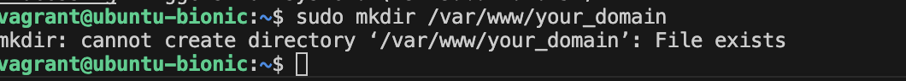

---

## Step 13: Set Directory Ownership

Command used:  
sudo chown -R $USER:$USER /var/www/your_domain  

### Output  
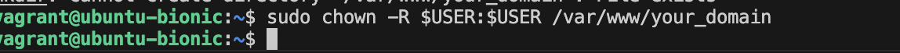

---

## Step 14: Create Nginx Configuration File

Command used:  
sudo nano /etc/nginx/sites-available/your_domain  

### Output  
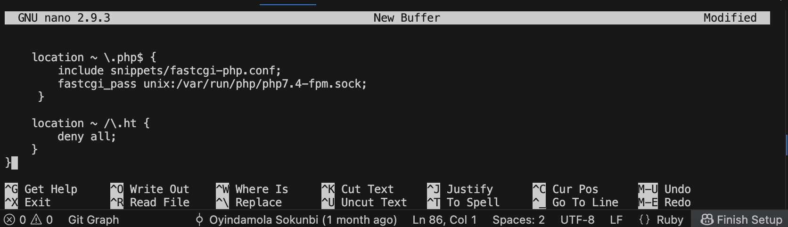

---

## Step 15: Enable Configuration

Command used:  
sudo ln -s /etc/nginx/sites-available/your_domain /etc/nginx/sites-enabled/  

### Output  
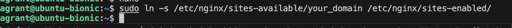

---

## Step 16: Disable Default Configuration

Command used:  
sudo unlink /etc/nginx/sites-enabled/default  

### Output  
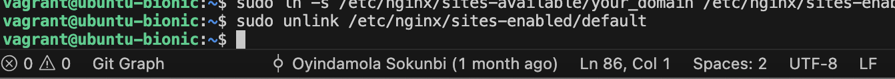

---

## Step 17: Test Nginx Configuration

Command used:  
sudo nginx -t  

### Output  
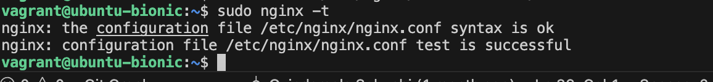

---

## Step 18: Reload Nginx

Command used:  
sudo systemctl reload nginx  

### Output  
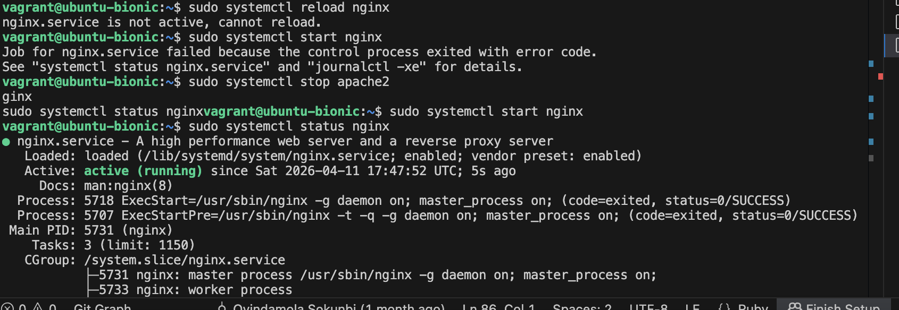

---

## Step 19: Create PHP Info File

Command used:  
nano /var/www/your_domain/info.php  

### Output  
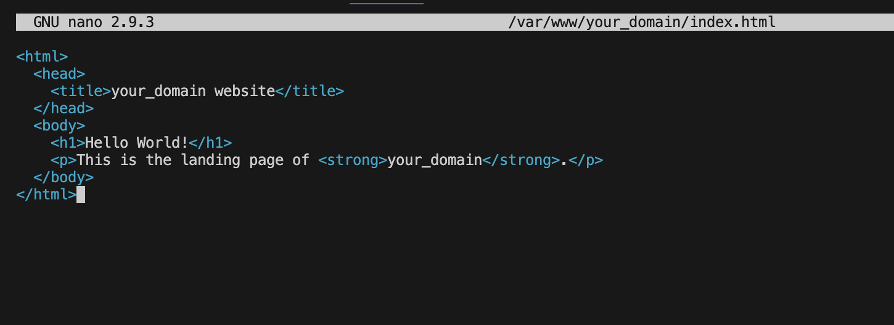

---

## Step 20: Access PHP Page in Browser

URL used:  
http://localhost:8080/info.php  

### Output  
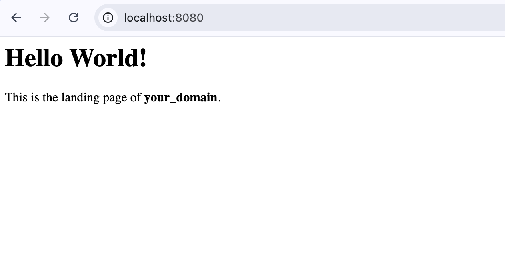